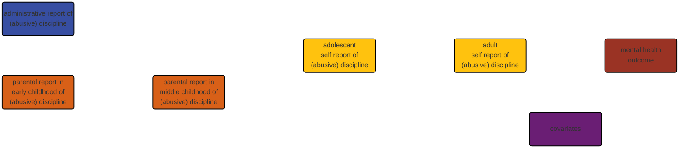

```mermaid

 %% block layout
 
 block-beta
   columns 9
   objective space space space space space space space space
   space space space space SR1 space SR2 space outcome
   P1 space P2 space space space space space space
   space space space space space space space covariates space

 %% define nodes

 SR1("adolescent <br>self report of <br>(abusive) discipline")

 SR2("adult <br>self report of <br>(abusive) discipline")

 P1("parental report in <br>early childhood of <br>(abusive) discipline")

 P2("parental report in <br>middle childhood of <br>(abusive) discipline")
 
 objective("administrative report of <br>(abusive) discipline")
 
 outcome("mental health <br>outcome")
 
 covariates("covariates")

 %% define classes
 
  classDef yellow fill:#FFC20E,stroke:#000000,stroke-width:2px,color:#000000;
  
 classDef blue fill:#374EA2,stroke:#000000,stroke-width:2px,color:#FFFFFF;
  
 classDef green fill:#00833D,stroke:#000000,stroke-width:2px,color:#FFFFFF;
  
 classDef orange fill:#D86018,stroke:#000000,stroke-width:2px,color:#FFFFFF;
  
 classDef red fill:#9A3324,stroke:#000000,stroke-width:2px,color:#FFFFFF;
 
  classDef purple fill:#6A1E74,stroke:#000000,stroke-width:2px,color:#FFFFFF;
 
 %% apply classes
 
  class objective blue
  
  class outcome red
  
  class P1 orange
  
  class P2 orange
  
  class SR1 yellow
  
  class SR2 yellow
  
  class covariates purple
 
```

