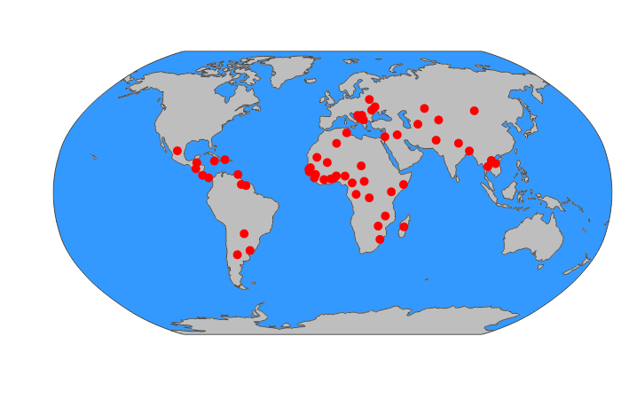

```{r setup, include=FALSE}

knitr::opts_chunk$set(echo = FALSE,
                      fig.margin=TRUE)

```

```{r, echo=FALSE, warning=FALSE, message=FALSE}

library(dplyr)

library(plotly)

library(countrycode)

```

# Data

The findings below are drawn from studies using the *Multiple Indicator Cluster Surveys* (MICS) conducted by UNICEF. Data include more than 200,000 families from a diverse sample of approximately 60 Low and Middle Income (LMICS) around the world.

```{r, echo=FALSE, warning=FALSE}

country <- c("Algeria",  "Argentina",  "Bangladesh",  "Barbados",  "Belarus",  "Belize",  "Benin",  "Bosnia and Herzegovina",  "Cameroon",  "Central African Republic",  "Chad",  "Democratic Republic of the Congo",  "Republic of the Congo",  "Costa Rica",  "Cote d'Ivoire",  "Dominican Republic",  "El Salvador",  "Eswatini",  "Ghana",  "Guinea",  "Guinea Bissau",  "Guyana",  "Iraq",  "Jamaica",  "Kazakhstan",  "Kenya",  "Kosovo",  "Kyrgyzstan",  "Laos", "Macedonia",  "Madagascar",  "Malawi",  "Mali",  "Mauritania",  "Mexico",  "Moldova",  "Mongolia",  "Montenegro",  "Nepal",  "Nigeria",  "Pakistan",  "Panama",  "Paraguay",  "Sao Tome and Principe",  "Senegal",  "Serbia",  "Sierra Leone",  "Somalia",  "St. Lucia",  "State of Palestine",  "Suriname",  "Thailand",  "The Gambia",  "Togo",  "Trinidad and Tobago",  "Tunisia",  "Turkmenistan",  "Ukraine",  "Uruguay",  "Vietnam",  "Zimbabwe")

MICScountries <- data.frame(country)

MICScountries$country_iso <- countrycode(MICScountries$country, 
                                 'country.name', 
                                 'iso3c')

```

```{r, echo=FALSE, fig.cap="Countries in MICS"}

g <- list(showframe = TRUE, 
          showcoastlines = TRUE, 
          showcountries = TRUE,
          showland = TRUE,
          countrycolor = toRGB("grey"),
          showocean = TRUE,
          # oceancolor = toRGB("steelblue1"),
          # projection = list(type = 'robinson'),
          projection = list(type = 'orthographic',
                            rotation = list(lon = 60,
                                            lat = 0,
                                            roll = 0)),
          showland = TRUE,
          landcolor = toRGB("grey"))

t <- list(
  family = "sans serif",
  size = 8,
  color = toRGB("black"))

p0 <- MICScountries %>% 
  plot_geo() %>% 
  add_trace(# z = 1,
    text = ~country, 
    hoverinfo = 'text',
    locations = ~country_iso, 
    marker = list(size=10, color = "red")) %>%
  layout(geo = g)

# dynamically choose between plotly and png based on output type

if(knitr::opts_knit$get("rmarkdown.pandoc.to") == "html5") {
  
  p0
  
} else {
  
  
}


```

# Analysis

The statistical methods employed in this work consist of various forms of multilevel models which are able to synthesize results across samples from multiple sources. Thus these findings are applicable to a diverse variety of cultures and contexts from around the globe.

# Findings

When studied in global context, across a diverse group of Low and Middle Income Countries (LMICs), these results have important implications for reducing violence against children, for improving family and child well-being, and for the cross-cultural study of parenting and child development (particularly the origins of aggression and antisocial behavior):

* There are differences in parenting *behaviors* across countries. Encouragingly, the most commonly employed disciplinary technique is explaining (verbal reasoning), but psychologically and physically aggressive forms of discipline are also very common.
* These differences in parenting *behaviors* notwithstanding, physical punishment (spanking) is consistently associated with *decreases in child socio-emotional development*, and particularly with *increases in child aggression*.
    + There is some variation in the effects of parental discipline (including spanking), on child well-being, but across multiple diverse countries, the *effects* of parental discipline (including spanking) are *remarkably consistent and nearly universal*.
    + Country level norms seem to have an association with child outcomes. In countries where spanking is more normative, child aggression is higher. 
    
> Put more succinctly, there are differences in the disciplinary **methods** employed by parents--and a modest percentage of these differences are attributable to the country in which parents live--but the **effects** of various forms of discipline are remarkably consistent.
    
* Psychological aggression (e.g. calling a child names) may have effects that are as harmful as those of physical punishment.
* Positive discipline--in the form of verbal reasoning--is generally associated with improvements in child well-being across countries, and should therefore be recommended. 
* The association of other forms of nonviolent discipline with child outcomes is less clear. It may be that the long term investments that parents make in children, such as spending time with children, letting children know that they love them, and listening to children have more positive effects than nonviolent discipline, but this has yet to be thoroughly researched in global context.
* Simulations with MICS data suggest that eliminating the use of physical punishment would be met with a large reduction in the amount of physical child abuse.

```{r, echo=FALSE, results='asis'}

# print a reference header when not HTML5

if(knitr::opts_knit$get("rmarkdown.pandoc.to") != "html5") {
  
  cat("# References")
  
}

```


