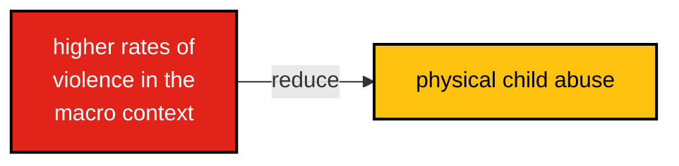

```mermaid

flowchart LR

  classDef yellow fill:#FFC20E,stroke:#000000,stroke-width:2px,color:#000000;
  
  classDef cyan fill:#1CABE2,stroke:#000000,stroke-width:2px,color:#FFFFFF;
  
  classDef red fill:#E2231A,stroke:#000000,stroke-width:2px,color:#FFFFFF;
  
  classDef orange fill:#F26A21,stroke:#000000,stroke-width:2px,color:#FFFFFF;
  
  macroviolence[higher rates of \nviolence in the \nmacro context]:::red --> |"reduce"| pabuse[physical child abuse]:::yellow


```
