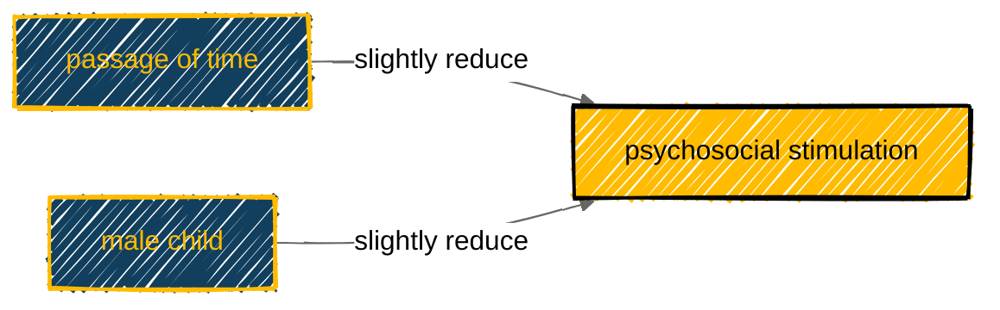

```mermaid
---
config:
  look: handDrawn
  theme: neutral
---

flowchart LR

  classDef yellow fill:#FFC20E,stroke:#000000,stroke-width:2px,color:#000000;
  
  classDef cyan fill:#1CABE2,stroke:#000000,stroke-width:2px,color:#FFFFFF;
  
  classDef red fill:#E2231A,stroke:#000000,stroke-width:2px,color:#FFFFFF;
  
  classDef orange fill:#F26A21,stroke:#000000,stroke-width:2px,color:#FFFFFF;

  classDef tidal fill:#113f5d,color:#FFBB00,stroke:#FFBB00,stroke-width:2px

  classDef tidal2 fill:#FFBB00,color:#000000,stroke:#000000,stroke-width:2px

  time[passage of time]:::tidal

  psychosocial[psychosocial stimulation]:::tidal2

  male[male child]:::tidal

  time --> |"slightly reduce"| psychosocial

  male --> |"slightly reduce"| psychosocial

```
